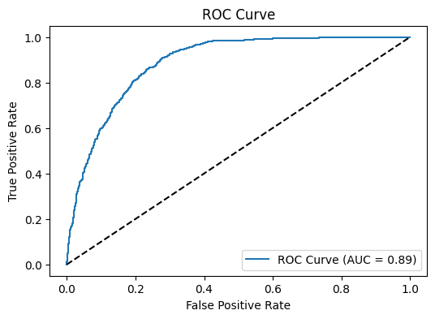

# Smokers’ Status Prediction

## ROC-AUC-CURVE 

## LEARNING-CURVE 

## LEARNING-CURVE-ENSAMBLE

## English

This project aims to predict individuals’ smoking status based on various health and biometric features using machine learning. The dataset includes multiple attributes like age, height, weight, blood pressure, and other health indicators, which are used to build a classification model.

Files in the Repository

	•	main.ipynb: Jupyter notebook containing data preprocessing, feature engineering, model training, and evaluation steps for predicting smoking status.
	•	README.md: This documentation file, providing an overview of the project and its contents.
	•	train.csv: The training dataset containing labeled data for model training.
	•	test.csv: The test dataset used to evaluate the model’s performance.
	•	submission.csv: File with model predictions on the test set, formatted for submission.
	•	sample_submission.csv: Sample format for the submission file to demonstrate the expected output format.

Features in the Dataset

	1.	Physical Attributes: Age, height, weight, waist circumference.
	2.	Vision and Hearing: Indicators for vision (left and right eyes) and hearing (left and right ears).
	3.	Blood Pressure: Systolic and diastolic blood pressure.
	4.	Blood Metrics and Health Indicators:
	•	Blood Sugar and Cholesterol: Fasting blood sugar, HDL, LDL, and total cholesterol.
	•	Liver Enzymes: AST, ALT, and GTP levels.
	•	Hemoglobin and Creatinine: Indicators for oxygen levels in the blood and kidney function, respectively.
	5.	Smoking Status and Dental Health: Indicates whether the person smokes and has dental caries.

Usage

	1.	Clone this repository and navigate to it.

git clone https://github.com/zuhriddinabduganiyev/Smokers-Status-Prediction.git
cd Smokers-Status-Prediction

	2.	Open main.ipynb in Jupyter Notebook to view the full data analysis, model training, and prediction steps.

## Russian

Прогнозирование Статуса Курения

Цель этого проекта — предсказать, курит человек или нет, используя различные медицинские и биометрические данные. Набор данных включает такие атрибуты, как возраст, рост, вес, артериальное давление и другие показатели здоровья, которые используются для создания модели классификации.

Файлы в репозитории

	•	main.ipynb: Jupyter-ноутбук, содержащий этапы предобработки данных, выделения признаков, обучения модели и оценки для предсказания статуса курения.
	•	README.md: Этот файл документации, предоставляющий обзор проекта и его содержимого.
	•	train.csv: Набор данных для обучения, содержащий помеченные данные для тренировки модели.
	•	test.csv: Набор данных для тестирования, используемый для оценки производительности модели.
	•	submission.csv: Файл с предсказаниями модели на тестовом наборе, оформленный для отправки.
	•	sample_submission.csv: Образец файла для отправки, демонстрирующий ожидаемый формат вывода.

Признаки в наборе данных

	1.	Физические атрибуты: Возраст, рост, вес, окружность талии.
	2.	Зрение и слух: Показатели зрения (левый и правый глаз) и слуха (левое и правое ухо).
	3.	Артериальное давление: Систолическое и диастолическое давление.
	4.	Показатели крови и здоровья:
	•	Уровень сахара и холестерина: Сахар натощак, HDL, LDL и общий холестерин.
	•	Ферменты печени: Уровни AST, ALT и GTP.
	•	Гемоглобин и креатинин: Показатели уровня кислорода в крови и функции почек соответственно.
	5.	Статус курения и здоровье зубов: Указывает, курит человек или нет, и наличие кариеса.

Использование

	1.	Клонируйте этот репозиторий и перейдите в него.

git clone https://github.com/zuhriddinabduganiyev/Smokers-Status-Prediction.git
cd Smokers-Status-Prediction

	2.	Откройте main.ipynb в Jupyter Notebook для просмотра анализа данных, обучения модели и этапов предсказания.

## Uzbek

Chekish Holatini Bashorat Qilish

Ushbu loyihaning maqsadi - shaxslarning turli sog’liq va biometrik ma’lumotlariga asoslanib, ularning chekish holatini bashorat qilishdir. Datasetda yoshi, bo’yi, vazni, qon bosimi va boshqa sog’liq ko’rsatkichlari kabi ma’lumotlar mavjud bo’lib, ulardan klassifikatsiya modelini yaratishda foydalaniladi.

Repodagi Fayllar

	•	main.ipynb: Jupyter daftarchasi bo’lib, unda ma’lumotlarni qayta ishlash, belgi yaratish, modelni o’qitish va baholash bosqichlari mavjud.
	•	README.md: Ushbu loyiha va uning mazmuni haqida umumiy ma’lumot beruvchi fayl.
	•	train.csv: Modelni o’qitish uchun belgilangan ma’lumotlar to’plami.
	•	test.csv: Modelning ishlashini baholash uchun ishlatiladigan test to’plami.
	•	submission.csv: Test to’plamidagi ma’lumotlarga asoslangan model natijalari, yuborish uchun formatlangan.
	•	sample_submission.csv: Natijalar uchun kutilgan formatni ko’rsatadigan namunaviy fayl.

Dataset Xususiyatlari

	1.	Jismoniy Ko’rsatkichlar: Yoshi, bo’yi, vazni, bel o’lchami.
	2.	Ko’rish va Eshitish: Har ikki ko’z va quloq uchun ko’rsatkichlar.
	3.	Qon Bosimi: Sistolik va diastolik bosim.
	4.	Qon Ko’rsatkichlari va Sog’liq Belgilari:
	•	Qondagi Shakar va Xolesterin: Och qoringa qondagi shakar, HDL, LDL va umumiy xolesterin.
	•	Jigar Fermentlari: AST, ALT va GTP miqdori.
	•	Gemoglobin va Kreatinin: Qondagi kislorod va buyrak faoliyatini ko’rsatuvchi ko’rsatkichlar.
	5.	Chekish va Tish Sog’lig’i: Shaxsning chekish holati va tish kariyesi mavjudligi.

Foydalanish

	1.	Ushbu repozitoriydan nusxa oling va unga o’ting.

git clone https://github.com/zuhriddinabduganiyev/Smokers-Status-Prediction.git
cd Smokers-Status-Prediction

	2.	main.ipynb faylini Jupyter Notebook’da ochib, tahlil va bashorat qilish bosqichlarini ko’rib chiqing.

